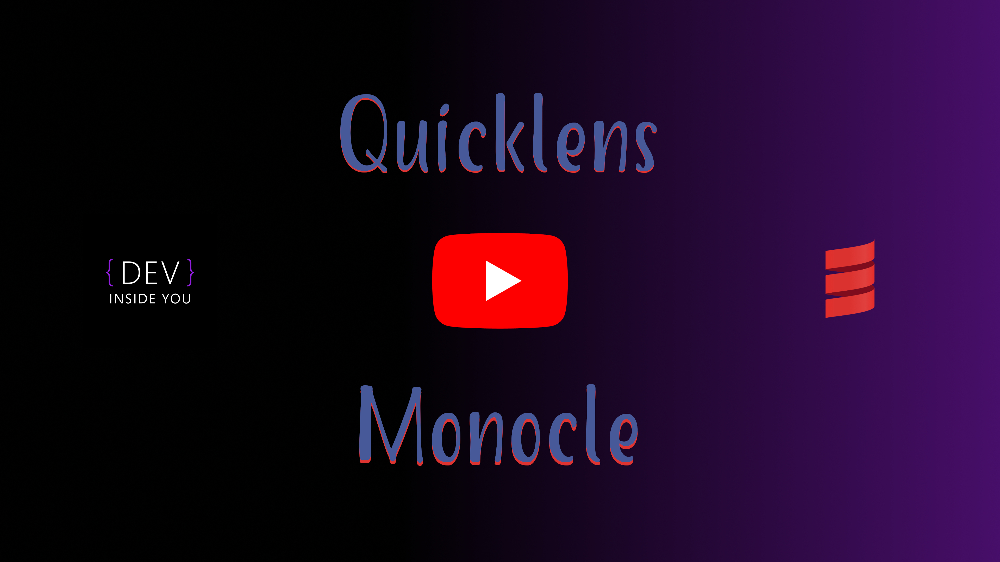

# [Monocle](http://julien-truffaut.github.io/Monocle/) vs [Quicklens](https://github.com/softwaremill/quicklens)

This project was created solely for educational purposes. It is inteded to be used as a cheat sheet for converting between these two great libraries.
